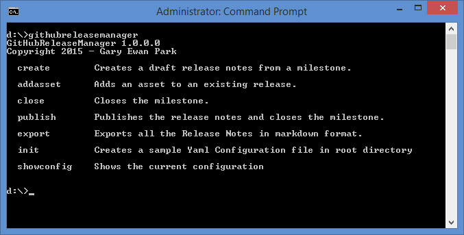

It is possible to install the portable version of GitReleaseManager using Chocolatey. Simply execute the following installation command:

```bash
choco install gitreleasemanager.portable
```

:::{.alert .alert-info}
Depending on which version of Chocolatey you are using, you may be required to
confirm the installation of the application. You can avoid this prompt using
the following command:

`choco install gitreleasemanager.portable -y`
:::

Once installed, GitReleaseManager should be immediately available on the command
line. You can either use:

```bash
gitreleasemanager
```

or:

```bash
grm
```

Which should then output something similar to the following:


